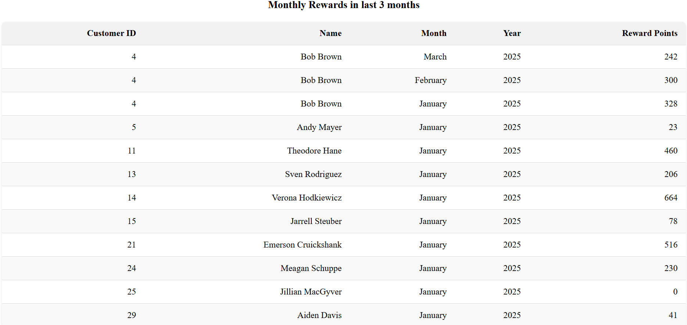

# Rewards Program

A React application that calculates customer rewards points based on purchase transactions.

#### Image of All Transactions Table


#### Image of Monthly Rewards Table


#### Image of Total Rewards Table


## Features

- Displays transaction history with reward points calculation
- Shows monthly rewards for each customer
- Presents total rewards earned by each customer
- Handles decimal values in purchase amounts
- Includes error handling and loading states
- Implements proper date sorting and formatting
- Includes comprehensive test coverage
## Running the Project

1. Install dependencies:

   ```bash
   npm install
   ```

2. Start the development server:

   ```bash
   npm run dev
   ```

3. Run tests:
   ```bash
   npm test
   ```

## Project Structure

```
src/
├── components/
│   ├── TransactionsTable.jsx
│   ├──styles/
│   │    └── table.css
│   ├── MonthlyRewardsTable.jsx
│   └── TotalRewardsTable.jsx
├── hooks/
|   └── useFetch.js
├── services/
│   └── fetchFromMockData.js
│
├── utils/
│   ├── calculations.js
│   ├── filterByMonths.js
|   ├── logger.js
│   └── monthlyAndTotalAggregatePoints.js
├── App.jsx
└── main.jsx
```

## Implementation Details

1. **Points Calculation**

   - 2 points for every dollar spent over $100
   - 1 point for every dollar spent between $50-$100
   - Proper handling of decimal values

2. **Data Management**

   - Simulated async API call
   - Sorted transactions by date
   - Aggregated rewards by month and customer

3. **Error Handling**

   - Comprehensive error handling
   - Loading states
   - Logging service

4. **Testing**
   - Jest test cases for calculations
   - Coverage for edge cases
   - Decimal handling tests


## Technical Decisions

1. **Pure Functions**

   - Used pure functions for calculations
   - Avoided mutations using reduce/map
   - Extracted business logic to separate services

2. **Error Handling**

   - Implemented proper error boundaries
   - Added loading states
   - Included logging service

3. **Code Organization**

   - Separated concerns into components
   - Maintained single responsibility principle
   - Used proper naming conventions

4. **Testing**
   - Comprehensive test cases
   - Coverage for edge cases
   - Proper test organization


